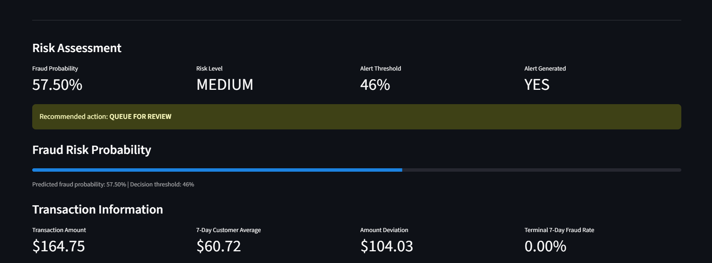
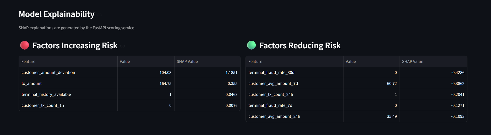
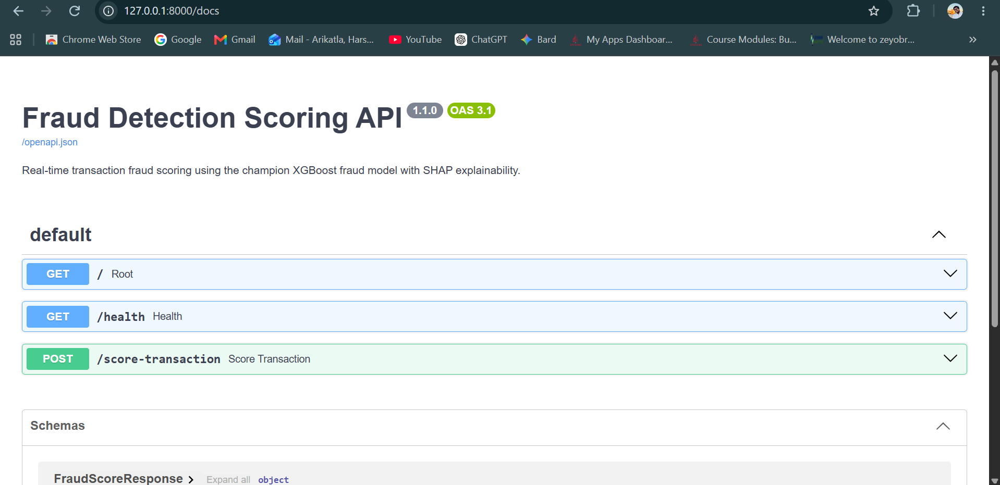
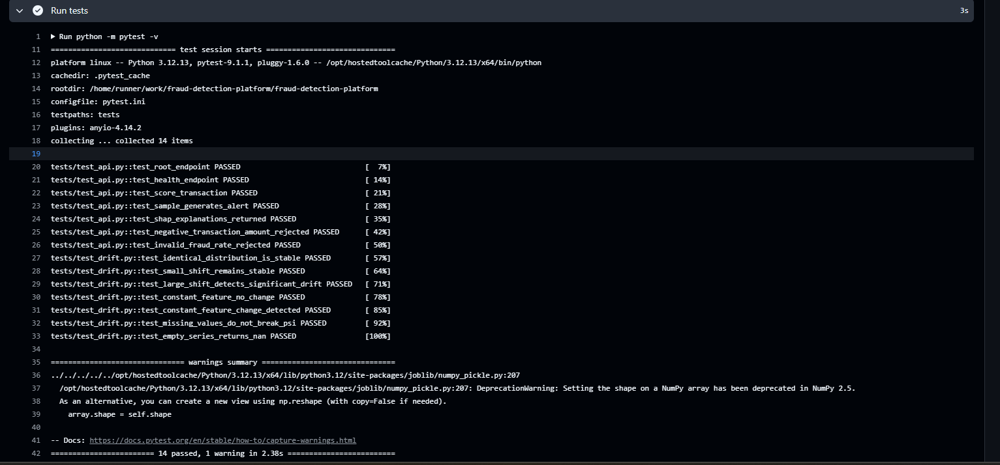

# Fraud Detection Platform

An end-to-end machine learning fraud detection platform covering **data engineering, leakage-safe feature engineering, XGBoost modeling, business-cost optimization, SHAP explainability, REST API serving, an investigator dashboard, production monitoring, automated testing, CI, and Docker deployment configuration**.

The project is designed around a practical question:

> How do you take a fraud model beyond a notebook and turn it into an explainable, monitored, testable ML system?

---

## Highlights

- **1.75M+ transactions** processed through the modeling pipeline
- Time-based train / validation / test methodology
- Leakage-safe customer and terminal behavioral features
- **XGBoost champion model**
- **0.8866 ROC-AUC**
- **0.6613 PR-AUC**
- **75.50% recall** on the September holdout period
- Business-cost optimized operating threshold
- Precision@K / Recall@K investigation-capacity analysis
- SHAP global and transaction-level explanations
- FastAPI real-time scoring service
- Streamlit fraud-investigation dashboard
- Feature drift monitoring with PSI
- Prediction-score drift monitoring
- Delayed-label model-performance monitoring
- Unified model-health reporting
- Drift stress testing
- **14 automated tests**
- GitHub Actions CI
- Docker / Docker Compose configuration

---

# Demo

## Fraud Investigator Dashboard

The Streamlit application provides transaction-level fraud scoring, risk classification, alert decisions, and recommended investigation actions.



---

## SHAP Explainability

Every scored transaction can include factors that increase or reduce predicted fraud risk.



---

## FastAPI Scoring Service

The champion model is exposed through a FastAPI REST service with health and transaction-scoring endpoints.



---

## Automated CI

The complete automated test suite runs through GitHub Actions on a Linux runner.



---

# System Architecture

```text
                         Transaction Data
                                |
                                v
                           PostgreSQL
                                |
                                v
                       Feature Engineering
                                |
               +----------------+----------------+
               |                                 |
               v                                 v
       Customer Behavioral              Delayed Terminal
            Features                     Risk Features
               |                                 |
               +----------------+----------------+
                                |
                                v
                        Modeling Dataset
                                |
                                v
                        Time-Based Split
                                |
                   +------------+------------+
                   |                         |
                   v                         v
               XGBoost                Isolation Forest
               Champion               Anomaly Baseline
                   |
                   v
          Threshold Optimization
                   |
                   v
           Business Cost Analysis
                   |
                   v
           Persisted ML Artifacts
                   |
            +------+------+
            |             |
            v             v
         FastAPI       Streamlit
       Scoring API     Dashboard
            |
            v
     SHAP Explanations


                  Production Monitoring
                           |
          +----------------+----------------+
          |                |                |
          v                v                v
    Feature Drift    Prediction-Score   Delayed-Label
        (PSI)             Drift          Performance
          |                |                |
          +----------------+----------------+
                           |
                           v
                  Unified Model Health
                           |
                           v
              HEALTHY / MONITOR / REVIEW


                    Engineering Quality
                           |
                           v
                 Pytest -> GitHub Actions
```

---

# Dataset

The modeling dataset contains:

```text
1,754,155 transactions
```

Fraud detection is highly imbalanced, so transactions are split **chronologically** rather than randomly.

| Dataset | Transactions |
|---|---:|
| Training | 1,169,723 |
| Validation | 296,559 |
| Test | 287,873 |

The final test period contains September transactions with approximately:

```text
Fraud prevalence: 0.8848%
```

Because fewer than 1% of transactions are fraudulent, metrics such as **PR-AUC, recall, precision, Precision@K, and business cost** are more informative than accuracy.

---

# Leakage-Safe Feature Engineering

The champion model uses **13 features**.

### Transaction Features

```text
tx_amount
during_weekend
during_night
```

### Customer Behavioral Features

```text
customer_tx_count_1h
customer_tx_count_6h
customer_tx_count_24h
customer_avg_amount_24h
customer_avg_amount_7d
customer_amount_deviation
```

### Terminal Features

```text
terminal_tx_count_24h
terminal_fraud_rate_7d
terminal_fraud_rate_30d
terminal_history_available
```

The following identifiers and target fields are explicitly excluded from model features:

```text
tx_fraud
tx_fraud_scenario
transaction_id
customer_id
terminal_id
```

Historical terminal fraud features use a **7-day label-availability delay**.

This prevents fraud outcomes that would not have been known at transaction time from leaking into the model.

---

# Leakage Audit

To evaluate whether historical terminal-risk information provides legitimate predictive value, two models were compared.

### Behavioral Features Only

```text
ROC-AUC: 0.6528
PR-AUC:  0.2580
```

### Behavioral + Delayed Terminal Risk

```text
ROC-AUC: 0.8866
PR-AUC:  0.6613
```

PR-AUC improvement:

```text
+0.4033
```

Delayed terminal-risk features therefore provide substantial predictive information without using future fraud labels.

Because this project uses synthetic transaction data, persistent fraudulent-terminal patterns may be stronger than those observed in a real payment portfolio.

---

# Champion Model

The production candidate is an:

```text
XGBoost Classifier
```

Training class distribution:

```text
Legitimate transactions: 1,160,258
Fraud transactions:          9,465

scale_pos_weight: 122.58
```

Class weighting helps address the extreme class imbalance.

---

# Final Test Performance

The business-selected operating threshold was frozen before final test evaluation at:

```text
0.46
```

September holdout performance:

| Metric | Result |
|---|---:|
| ROC-AUC | **0.8866** |
| PR-AUC | **0.6613** |
| Precision | 18.73% |
| Recall | **75.50%** |
| F1 | 0.3002 |
| Alert Rate | 3.57% |

Confusion matrix:

```text
True Positives:   1,923
False Positives:  8,343
False Negatives:    624
True Negatives: 276,983
```

The model identifies approximately **75.5% of fraud transactions** while sending approximately **3.57% of transactions** to investigators.

---

# Business Threshold Optimization

A fraud model should not automatically operate at a probability threshold of `0.50`.

The project evaluates candidate thresholds using explicit false-positive and false-negative costs.

Base assumptions:

```text
False-positive cost: $5
False-negative cost: $500
```

Sensitivity analysis:

| Scenario | FP Cost | FN Cost | Threshold | Recall | Precision | Alert Rate |
|---|---:|---:|---:|---:|---:|---:|
| Low fraud cost | $5 | $100 | 0.78 | 71.23% | 47.47% | 1.35% |
| Moderate | $5 | $250 | 0.65 | 72.80% | 36.30% | 1.80% |
| **Base** | **$5** | **$500** | **0.46** | **74.97%** | **19.47%** | **3.47%** |
| High fraud cost | $5 | $1,000 | 0.39 | 76.21% | 14.21% | 4.83% |
| High review cost | $20 | $500 | 0.78 | 71.23% | 47.47% | 1.35% |

The selected production threshold is:

```text
0.46
```

Estimated business cost on the September test period under the base assumptions:

```text
$353,715
```

---

# Investigation Capacity — Precision@K

Fraud operations teams typically cannot investigate every transaction.

The model is therefore also evaluated under fixed alert capacities.

| Investigation Capacity | Fraud Found | Precision@K | Recall@K | Lift vs Random |
|---:|---:|---:|---:|---:|
| 500 | 499 | 99.80% | 19.59% | 112.8x |
| 1,000 | 992 | 99.20% | 38.95% | 112.1x |
| 2,500 | 1,665 | 66.60% | 65.37% | 75.3x |
| 5,000 | 1,840 | 36.80% | 72.24% | 41.6x |
| 10,000 | 1,921 | 19.21% | 75.42% | 21.7x |

For example, among the **1,000 highest-risk transactions**:

```text
Fraud transactions found: 992
Precision@1000:          99.20%
Recall@1000:             38.95%
```

This demonstrates strong ranking performance for investigation teams operating under limited review capacity.

---

# Anomaly Detection Benchmark

An **Isolation Forest** model provides an unsupervised benchmark.

```text
ROC-AUC: 0.8567
PR-AUC:  0.2610
```

At the top 1,000 transactions:

```text
Fraud found:     438
Precision@1000: 43.80%
Recall@1000:    17.20%
Lift:            49.5x
```

The supervised XGBoost model substantially outperforms the anomaly detector when reliable historical fraud labels are available.

---

# Model Explainability

The platform uses **SHAP** for both global and transaction-level explanations.

Global SHAP analysis was performed on 10,000 test transactions.

| Rank | Feature | Mean Absolute SHAP |
|---:|---|---:|
| 1 | customer_amount_deviation | 0.464557 |
| 2 | terminal_fraud_rate_30d | 0.431246 |
| 3 | tx_amount | 0.383059 |
| 4 | customer_avg_amount_7d | 0.371537 |
| 5 | terminal_fraud_rate_7d | 0.348273 |

At scoring time, the investigator dashboard presents separate factors that:

```text
Increase fraud risk
Reduce fraud risk
```

This gives investigators context around the model's decision rather than exposing only a probability.

---

# FastAPI Scoring Service

The persisted champion model is served through FastAPI.

Start the API:

```bash
python -m uvicorn src.api:app --reload --host 127.0.0.1 --port 8000
```

Swagger documentation:

```text
http://127.0.0.1:8000/docs
```

Main endpoints:

```text
GET  /
GET  /health
POST /score-transaction
```

Example scoring response:

```json
{
  "fraud_probability": 0.560381,
  "fraud_probability_pct": 56.04,
  "decision_threshold": 0.46,
  "alert_generated": true,
  "risk_level": "MEDIUM",
  "recommended_action": "QUEUE FOR REVIEW",
  "model_name": "XGBoost Fraud Detection Champion"
}
```

The scoring response also includes SHAP-based factors that increase and reduce predicted fraud risk.

---

# Streamlit Investigation Dashboard

Start the API first, then launch the dashboard:

```bash
python -m streamlit run src/app.py
```

Open:

```text
http://localhost:8501
```

The dashboard communicates with FastAPI and provides:

- Transaction input controls
- Fraud probability
- Risk level
- Production threshold
- Alert decision
- Recommended action
- Transaction context
- SHAP explanations
- Model information

---

# Production Monitoring

The project monitors the model at **three different levels**.

```text
Incoming Features
      |
      v
Feature Drift
      |
      v
Prediction Scores
      |
      v
Score Drift
      |
      v
Delayed Fraud Labels
      |
      v
Performance Monitoring
      |
      v
Unified Model Health
```

This helps distinguish changes in the input population from changes in model behavior and actual predictive degradation.

---

## 1. Feature Drift Monitoring

Population Stability Index (**PSI**) is calculated across all 13 model features.

Monitoring policy:

```text
PSI < 0.10           -> STABLE
0.10 <= PSI < 0.25   -> MODERATE DRIFT
PSI >= 0.25          -> SIGNIFICANT DRIFT
```

September results:

```text
Stable features:             12
Moderate drift features:      0
Significant drift features:   1
```

The only significant change was:

```text
terminal_history_available
PSI: 0.7353
```

This variable naturally changes as more terminals accumulate sufficient historical observations.

The monitoring framework therefore separates expected **feature-maturity drift** from unexpected predictive-feature drift.

```text
Feature Drift Status:
STABLE — EXPECTED FEATURE MATURITY
```

---

## 2. Prediction-Score Monitoring

The distribution of model fraud probabilities is monitored independently from the input features.

Results:

| Metric | Reference | Current |
|---|---:|---:|
| Mean score | 0.1836 | 0.1898 |
| Median score | 0.1595 | 0.1629 |
| P95 | 0.3717 | 0.3840 |
| P99 | 0.8734 | 0.9163 |
| Alert Rate | 3.31% | 3.56% |

Prediction-score PSI:

```text
0.0129
```

Status:

```text
STABLE
```

Alert-rate change was only:

```text
+0.25 percentage points
```

Fraud transactions also continued to receive substantially higher model scores:

```text
Average legitimate score: 0.1846
Average fraud score:      0.7759
Median fraud score:       0.9909
```

---

## 3. Delayed-Label Performance Monitoring

Once fraud outcomes mature, the monitoring layer evaluates actual predictive performance.

September performance:

```text
PR-AUC:    0.6620
Precision: 0.1878
Recall:    0.7554
```

Compared with the pooled reference period:

```text
Reference PR-AUC:    0.6960
Current PR-AUC:      0.6620
Change:             -0.0340

Reference Precision: 0.1982
Current Precision:   0.1878
Change:             -0.0104

Reference Recall:    0.8098
Current Recall:      0.7554
Change:             -0.0544
```

The recall decrease crosses the project's moderate degradation threshold.

Therefore:

```text
Model Performance Status: MONITOR
```

This does **not** automatically trigger retraining. It indicates that performance should be watched across subsequent mature-label periods.

---

# Unified Model Health

The three monitoring layers are consolidated into a single operational health report.

Current state:

```text
Feature Drift:          STABLE — EXPECTED FEATURE MATURITY
Prediction Score Drift: STABLE
Model Performance:      MONITOR

----------------------------------------
Overall Model Health:   MONITOR
----------------------------------------
```

Active alert:

```text
MODERATE RECALL DEGRADATION
```

This demonstrates a tiered governance approach:

```text
HEALTHY
   |
   v
MONITOR
   |
   v
REVIEW REQUIRED
```

The system does not automatically retrain because of one moderate signal. Significant or persistent degradation would trigger model review.

Run the unified report with:

```bash
python src/model_health_report.py
```

---

# Drift Stress Testing

The drift detector was also evaluated against an artificially shifted production population.

Synthetic drift was introduced into:

- Transaction amounts
- Customer transaction velocity
- Customer spending behavior
- Customer amount deviation
- Terminal transaction velocity
- Historical terminal risk

The stress test produced:

```text
Stable features:             3
Moderate drift features:     0
Significant drift features: 10
```

The monitoring system correctly escalated to:

```text
REVIEW REQUIRED
```

This validates that the monitoring policy can distinguish expected production evolution from substantial unexpected drift.

---

# Automated Testing

The repository contains **14 automated tests**.

Run locally:

```bash
python -m pytest -v
```

Current coverage includes:

- API root endpoint
- Health endpoint
- Fraud scoring
- Alert generation
- SHAP explanations
- Request validation
- Invalid fraud-rate validation
- Stable PSI distributions
- Small distribution shifts
- Significant distribution shifts
- Constant features
- Changed constant features
- Missing values
- Empty input handling

Current result:

```text
14 passed
```

---

# Continuous Integration

GitHub Actions automatically executes the test suite for pushes and pull requests to `main`.

Workflow:

```text
.github/workflows/tests.yml
```

Pipeline:

```text
Checkout Repository
        |
        v
Set Up Python 3.12
        |
        v
Install Dependencies
        |
        v
Run Pytest
        |
        v
14 Automated Tests
```

The suite has been validated on both the Windows development environment and GitHub's Linux runner.

---

# Docker

The API and dashboard include Docker deployment configuration.

```text
Dockerfile
docker-compose.yml
```

Architecture:

```text
+----------------------+
| Streamlit Dashboard  |
|        :8501         |
+----------+-----------+
           |
           | HTTP
           v
+----------------------+
| FastAPI Scoring API  |
|        :8000         |
+----------+-----------+
           |
           v
+----------------------+
| Persisted XGBoost    |
| Model + Imputer      |
| Metadata + SHAP      |
+----------------------+
```

Run:

```bash
docker compose up --build
```

Docker execution requires host virtualization support and a functioning Docker engine.

---

# Model Artifacts

The trained production artifacts are persisted under:

```text
models/
```

```text
fraud_xgboost_model.joblib
fraud_imputer.joblib
fraud_model_metadata.joblib
```

The metadata stores the feature configuration and frozen decision threshold so the serving layer can load the trained champion model without retraining at startup.

---

# Project Structure

```text
fraud-detection-platform/
|
|-- .github/
|   `-- workflows/
|       `-- tests.yml
|
|-- docs/
|   `-- images/
|       |-- api-swagger.png
|       |-- dashboard-explainability.png
|       |-- dashboard-overview.png
|       `-- github-actions-ci.png
|
|-- models/
|   |-- fraud_imputer.joblib
|   |-- fraud_model_metadata.joblib
|   `-- fraud_xgboost_model.joblib
|
|-- src/
|   |-- api.py
|   |-- app.py
|   |-- audit_feature_leakage.py
|   |-- build_behavioral_features.py
|   |-- build_delayed_fraud_features.py
|   |-- create_features.py
|   |-- evaluate_business_cost.py
|   |-- evaluate_cost_sensitivity.py
|   |-- evaluate_thresholds.py
|   |-- evaluate_top_k.py
|   |-- explain_model.py
|   |-- explain_transaction.py
|   |-- explore_data.py
|   |-- final_model_report.py
|   |-- inspect_transactions.py
|   |-- load_transactions.py
|   |-- model_health_report.py
|   |-- monitor_drift.py
|   |-- monitor_model_performance.py
|   |-- monitor_prediction_scores.py
|   |-- save_champion_model.py
|   |-- test_drift_detection.py
|   |-- test_saved_model.py
|   |-- train_anomaly_model.py
|   |-- train_baseline.py
|   `-- train_challenger.py
|
|-- tests/
|   |-- __init__.py
|   |-- test_api.py
|   `-- test_drift.py
|
|-- .gitignore
|-- Dockerfile
|-- docker-compose.yml
|-- pytest.ini
|-- requirements.txt
`-- README.md
```

---

# Technology Stack

| Area | Technologies |
|---|---|
| Machine Learning | Python, pandas, NumPy, scikit-learn, XGBoost |
| Explainability | SHAP |
| Data | PostgreSQL, SQLAlchemy |
| API | FastAPI, Uvicorn, Pydantic |
| Application | Streamlit |
| Monitoring | PSI, scikit-learn metrics |
| Testing | pytest |
| CI | GitHub Actions |
| Deployment | Docker, Docker Compose |
| Persistence | joblib |

---

# Key Engineering Decisions

### Time-Based Validation

Transactions are split chronologically rather than randomly so evaluation more closely represents deployment against future transactions.

### Leakage-Aware Historical Features

Terminal fraud rates use delayed labels instead of fraud outcomes that would not have been available when the transaction occurred.

### Imbalance-Aware Evaluation

PR-AUC, recall, Precision@K, Recall@K, and business cost are emphasized instead of accuracy.

### Business-Driven Thresholding

The production threshold is selected using false-positive and false-negative costs rather than automatically using `0.50`.

### Capacity-Aware Evaluation

Precision@K and Recall@K evaluate model usefulness when investigators can only review a limited number of transactions.

### Explainable Predictions

SHAP provides both global feature importance and transaction-level explanations.

### Multi-Layer Monitoring

Feature distributions, prediction scores, and delayed-label performance are monitored independently before being consolidated into overall model health.

### Tiered Model Governance

Monitoring distinguishes:

```text
HEALTHY
MONITOR
REVIEW REQUIRED
```

Moderate degradation does not automatically trigger retraining.

### Automated Quality Control

API and drift-monitoring tests execute automatically through GitHub Actions.

---

# Limitations

This project uses a **synthetic fraud dataset**.

Synthetic data can contain stronger or cleaner fraud patterns than real payment environments. Persistent terminal-risk patterns, in particular, may be more predictive than they would be in a live financial portfolio.

The false-positive and false-negative costs used for threshold optimization are illustrative assumptions rather than values obtained from a real fraud-operations organization.

The project demonstrates production-oriented ML patterns but is not a production banking system. Additional controls would be required for real financial deployment, including authentication, authorization, secrets management, encryption, audit controls, data-quality SLAs, observability, infrastructure hardening, and formal model governance.

---

# Future Improvements

Potential extensions include:

- Automated retraining workflows
- Persistent monitoring history
- Model registry and versioning
- Experiment tracking
- API authentication and authorization
- Batch scoring
- Database-backed investigation queues
- Investigator feedback capture
- Model calibration monitoring
- Segment-level fairness/performance monitoring
- Data-quality and feature-freshness checks
- API latency/error monitoring
- Cloud deployment
- Scheduled monitoring reports
- Production alerting

---

# What This Project Demonstrates

This repository goes beyond training a classifier.

It demonstrates an end-to-end workflow spanning:

```text
Data Engineering
        ↓
Leakage-Safe Feature Engineering
        ↓
Supervised + Unsupervised Modeling
        ↓
Business Threshold Optimization
        ↓
Capacity-Aware Evaluation
        ↓
SHAP Explainability
        ↓
Model Persistence
        ↓
REST API Serving
        ↓
Investigator Dashboard
        ↓
Feature + Score + Performance Monitoring
        ↓
Unified Model Health
        ↓
Automated Testing
        ↓
Continuous Integration
        ↓
Containerized Deployment Configuration
```

Final champion model:

```text
Model:      XGBoost
ROC-AUC:    0.8866
PR-AUC:     0.6613
Recall:     75.50%
Threshold:  0.46
```

Current unified monitoring state:

```text
Overall Model Health: MONITOR

Reason:
Moderate recall degradation while feature
and prediction-score distributions remain stable.
```

The goal is not simply to produce a high-performing fraud classifier, but to demonstrate how such a model can be **evaluated, explained, served, tested, monitored, and governed as an ML system**.